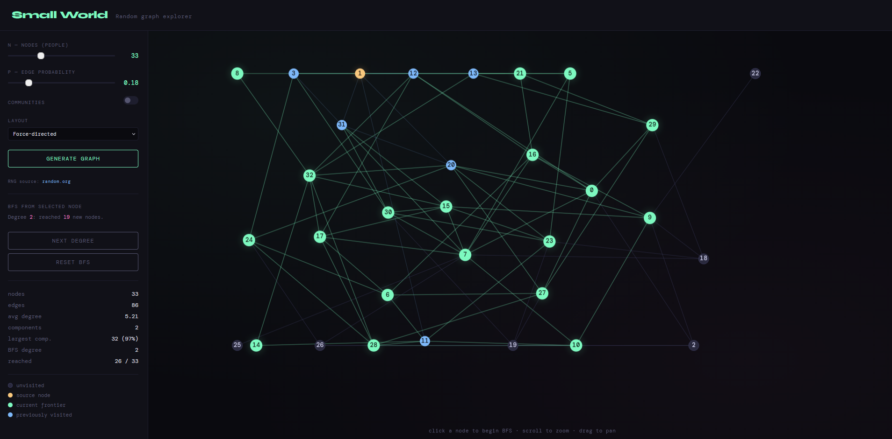

# Small World

An interactive browser-based explorer for random graph theory, built to demonstrate the **small-world phenomenon** — the idea that any two people in a large network are connected through surprisingly few intermediate links.

## Features

- **G(n, p) model** — generate random graphs with `n` nodes and edge probability `p`
- **Stochastic Block Model** — optional community structure with configurable cluster count and strength
- **Step-by-step BFS traversal** — click any node to start, advance degree by degree to observe how quickly the graph is covered
- **Two layouts** — force-directed (Fruchterman-Reingold) and circle
- **True randomness** — optional integration with [random.org](https://random.org) JSON-RPC API for hardware-sourced random numbers, with a Math.random() fallback
- **Live statistics** — node/edge count, average degree, connected components, largest component, BFS progress

## Demo



## Getting started

### No API key (quickest)

1. Clone or download the repository
2. Open `index.html` in a browser
3. Toggle **use random.org** off in the sidebar — the app works entirely with `Math.random()`

### With random.org API key (true randomness)

1. Get a free API key at [api.random.org/dashboard](https://api.random.org/dashboard)
2. Copy the config template:
   ```
   cp js/config.example.js js/config.js
   ```
3. Open `js/config.js` and replace `YOUR_API_KEY_HERE` with your key
4. Open `index.html` in a browser — the **use random.org** toggle will now fetch real random bits

> `config.js` is listed in `.gitignore` so your key is never committed.

## How to use

| Control | Description |
|---|---|
| **n — nodes** | Number of nodes in the graph (5–100) |
| **p — edge probability** | Probability that any two nodes are connected |
| **communities** | Toggle Stochastic Block Model; reveals k clusters with stronger internal connections |
| **k** | Number of communities |
| **cluster strength** | How many times more likely within-community edges are vs. cross-community edges |
| **Layout** | Force-directed separates clusters naturally; Circle shows all nodes on a ring |
| **use random.org** | Toggle between hardware RNG (random.org) and Math.random() |
| **Generate Graph** | Build a new random graph with current settings |

**BFS traversal:**
1. Click any node to set it as the source (highlighted in yellow)
2. Press **Next Degree** to expand the frontier one hop at a time
3. Watch how few steps it takes to reach every node — this is the small-world effect
4. Click the same node again or press **Reset BFS** to clear

**Navigation:** scroll to zoom · drag to pan

## Concepts

### G(n, p)

Each pair of `n` nodes is independently connected with probability `p`. The graph transitions sharply from mostly isolated nodes to a single giant connected component as `p` crosses `1/n` (the **phase transition**). Average degree is `(n-1)·p`.

### Stochastic Block Model (SBM)

Nodes are divided into `k` communities. Edges within the same community form with probability `p_in = p × clusterStrength`, and edges across communities form with `p_out = p`. This produces the clustered topology seen in real social networks.

### Small-world phenomenon

Even in sparse graphs (low `p`), BFS typically reaches all nodes within `O(log n / log(np))` steps — logarithmic in the graph size. Stanley Milgram's 1967 experiment estimated this distance to be around **6 degrees of separation** for the US population.

### Force-directed layout

Uses a Fruchterman-Reingold style simulation: nodes repel each other, edges attract their endpoints, and community centroids are pulled apart. The result places densely connected nodes close together.

## File structure

```
small_world/
├── index.html          # markup and layout
├── styles.css          # all styles
├── js/                 # all application JavaScript
│   ├── config.js           # your API key (gitignored)
│   ├── config.example.js   # copy → config.js and fill in your key
│   ├── state.js            # shared DOM references and mutable state
│   ├── rng.js              # random.org JSON-RPC fetch
│   ├── graph.js            # graph generation, force layout, stats
│   ├── bfs.js              # BFS traversal logic
│   ├── renderer.js         # canvas draw and animation
│   └── main.js             # event listeners and app init
└── .gitignore
```

## License

Faculty of Sciences, University of Novi Sad
